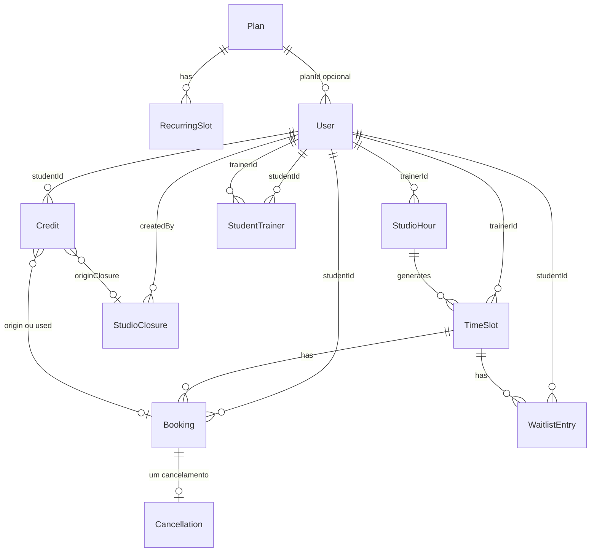

# Domínio persistido — Studio EMAR

Fonte do vocabulário: schemas Zod em `packages/shared`.
Persistência: Prisma em `apps/api/prisma/schema.prisma`.

`OccupancyDashboard` é consulta. Não é tabela.

Aluno não é entidade própria: é `User` com `role = STUDENT`
(ADR-009).

## Modelo ER

## Entidades

| Tabela | Contrato Zod | Observação |
|---|---|---|
| Plan | Plan | Frequência semanal do pacote |
| User | User | `passwordHash` e reset token só no banco (ADR-013 / ADR-014) |
| RecurringSlot | RecurringSlot | Agenda regular do plano |
| StudioHour | StudioHour | Turma recorrente do estúdio (dias + intervalo) |
| TimeSlot | TimeSlot | `enrolledCount` denormalizado; `studioHourId` opcional |
| StudentTrainer | — | Vínculo N:N aluno–treinador (RN-024) |
| StudioClosure | StudioClosure | Férias/recesso (RN-014 / RN-019) |
| WaitlistEntry | WaitlistEntry | Fila FIFO |
| Booking | Booking | Regular ou reposição |
| Cancellation | Cancellation | Um registro por reserva |
| Credit | Credit | Sem crédito avulso |

## Invariantes

- `User.email` é único.
- Crédito deriva de aula ou fechamento (`originBookingId` ou
  `originClosureId`). Não há crédito avulso (RN-017, RN-019).
- Origens: `CANCELLATION`, `TRAINER_CANCELLATION`,
  `CLOSURE_COMPENSATION`.
- Status do crédito: `AVAILABLE`, `USED`, `EXPIRED`, `ANNULLED`.
- `Cancellation.bookingId` é único.
- `WaitlistEntry` é único em `(timeSlotId, studentId)`.
- Recorrência do plano é única em `(planId, weekday, time)`.
- `StudioHour` gera `TimeSlot`s futuros; aula pontual não tem
  `studioHourId`.
- Reserva confirmada no mesmo horário: a FASE 5 valida.
  Sem unique parcial no Prisma.

## Fora deste documento

Regras de cancelamento, crédito e capacidade estão no
backend. Helpers no shared só repetem a fórmula (12h / 30d).
